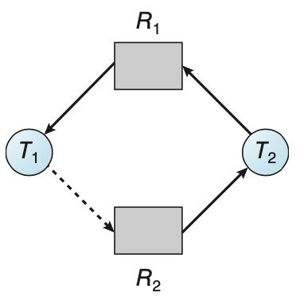

## Deadlock

### Overview

Computer system is comprised of several resource types $R_i$ with instances $W_i$. Processes use these in the following manner

1. Request: if request can't be satisfied, requesting thread must wait
2. Use: thread operates on the resource 
3. Release: thread releases resource

**Deadlock**: every process in a set is waiting for event from another process in the set

**Livelock**: processes continuously attempts an action that fails

Characterization of Deadlocks

- **Mutual Exclusion**: only one process can hold each resource instance at a time
- **Hold and Wait**: each process is holding a resource and is waiting on a resource held by another process
- **No Preemption**: resource can only be voluntarily released by the process after completion of its task
- **Circular Wait**: each process in the set is waiting for another process in the set in a circular fashion

How to deal with deadlocks

- Ignore: benefits of dealing with deadlocks not worth its overhead
- Prevention: ensure one of the 4 characterizations can never be met
- Avoidance: give system additional information about resource requirements for each process to prevent deadlock
- Detection/Recovery: periodically check for deadlock and recover if necessary

### Resource Allocation Graph

Sets of vertices $T$ for active threads and $R$ for resource types

- **request edge**: $T_i \rightarrow R_j$
- **assignment edge**: $T_j \rightarrow T_i$
- No cycle $\implies$ no deadlock
- Cycle $\implies$ for only 1 instance per resource deadlock. For multiple instances possible deadlock

{ height=200px}

### Deadlock Prevention

- Mutual Exclusion: Make resource sharable (e.g. read file)
  
  - Not possible for all resource types
- Hold and Wait: allocate all resources a process needs before execution or only allow process to request if it has no resources

  - Can lead to low resource utilization or starvation

- No preemption: if $P_1$ is holding resources needed by $P_2$, $P_1$ will release all of its resources and wait for them. $P_1$ will only restart when it regains these resources

  - Only works for data types whose state can easily be saved (NOT mutex locks and semaphores)

- Circular wait: impose an ordering where the process can only request resources in an increasing order

### Deadlock Avoidance

**Safe State**: sequences of processes such that resource requests for $P_i$ can be satisfied by the curr resources and resources from $P_j, j < i$

- Safe state $\implies$ no deadlock
- Unsafe state $\implies$ possible deadlock
- Avoidance ensures that the system will never enter an unsafe state

For single instances of resources, use a **resource allocation graph**

- **claim edge**: $P_i \rightarrow R_j$ indicates process $P_i$ may request $R_j$ at some point
- claim edges are converted to request edges when request is made
- request edges are converted to assignment edges when the resource has been allocated. Only occurs if the assignment doesn't cause a cycle/deadlock
- assignment edge becomes claim edge when resource is released

{ height=200px}

For multiple instance of resources, use **banker's algorithm**

Let $n$ be the number of processes and $m$ be the number of resources. Data structures used

- **Available**: $m$ sized array for number of resources available for resource type $R_j$
- **Max**: $n \times m$ matrix for the maximum resource $P_i$ can request for resource type $R_j$
- **Allocation**: $n \times m$ matrix for the number of resources $P_i$ is currently allocated of resource type $R_j$
- **Need**: $n \times m$ matrix for number of resources $P_i$ needs of resource type $R_j$

**Safety Algorithm**

Let **Work** be an $m$ array and assigned Available. Let **Finish** be an $n$ array set to all `False`

1. Find an `i` such that `Finish[i] == False` and `Need[i] <= Work`. If no such `i` exists, goto last step
2. `Work = Work + Allocation`

    `Finish[i] = True`

    goto previous step

3. If `Finish[i] == True` for all `i`, then the system is safe

**Resource Allocation Algorithm**

Let **Request_i** be the request an $m$ array for $P_i$

1. If `Request_i <= Need_i`goto step 2. Otherewise raise an error since process is exceeding maximum claim
2. If `Request_i <= Available` goto step 3. Otherwise $P_i$ has to wait
3. Pretend to allocate resources to $P_i$

  - `Available = Available - Request`
  - `Allocation_i = Allocation_i + Request`
  - `Need_i = Need_i - Request_i`
  - If this yields a safe state, allocate resources to $P_i$. Otherwise $P_i$ must wait and allocation state is reverted

### Deadlock Detection

For single instances of resources, use **wait-for-graph**

- **wait edge**: $P_i \rightarrow P_j$ if $P_i$ is waiting for $P_j$
- System periodically calls detection check $O(n^2)$

{ height=200px}

### Deadlock Recovery

- Abort all deadlock processes
- Abort one process at a time until deadlock cycle is gone
- **victim**: want to select min costing process (e.g. how many resources it's holding or how long it's been running)
- **rollback**: return the aborted process to some safe state
- **starvation**: same process is selected as victim. Can use number of rollbacks as a priority factor

## CPU Scheduling

**CPU Scheduler** selects process from ready queue and allocates CPU to it. Goal is to maximize CPU utilization with multiprogramming

Process execution consists of swapping between **CPU burst cycles** and **I/O burst cycles**. Thus scheduling occurs when process

- Moves from running to waiting (I/O request)
- Moves from running to ready (Interrupt)
- Moves from waiting to ready (I/O complete)
- Terminates

**nonpreemptive** if CPU is only released if process is waiting or if it terminates. Otherwise **preemptive** and can lead to race conditions

**Dispatcher**: short term scheduler that selects process from ready queue and allocates CPU to it. **Dispatch latency** comes from

- Context switching
- Switching to user mode
- Jumping to the proper location in the user program

**Scheduling Criteria**

- **CPU Utilization**: keep CPU busy
- **Throughput**: number of processes that complete per unit time
- **Turnaround time**: how long it takes to finish executing a process
- **Waiting time**: time a process has been waiting in the ready queue
- **Response time**: time from the request to the first response produced (NOT output)

**First Come First Served (FCFS)**

- Long average wait time
- Results in **convoy effect**: short process behind long process (e.g. I/O bound processes behind CPU bound process)
- Only **nonpreemptive**

**Shortest Job First (SJF)**: associates each process with the length of the next CPU burst and selects the minimum length

- Optimal but hard to determine next length of CPU burst
- Can be estimated by taking the length of the previous CPU burst and using **exponential averaging**

  1. $t_n =$ length of nth CPU burst
  2. $\tau_{n+1} =$ predicted value of next CPU burst
  3. $0 \leq \alpha \leq 1$, typically $\alpha = 1/2$
  4. $\tau_{n+1} = \alpha t_n + (1 - \alpha) \tau_n$
- Can be **preemptive** (prioritize incoming process with shorter CPU burst) or **nonpreemptive**. 

**Priority Scheduling**: associates each process with a priority and selects the one with the highest priority (lowest number)

- Can be **nonpreemptive** or **preemptive** but can lead to **starvation** where low priority process is never executed

  - Solved using **aging** where we increase priority of a waiting process over time

**Round Robin**: each process gets a **time quantum**. Once time is done, it is preempted and added to the ready queue

- Given $n$ processes and $q$ time quantum, each $p$ gets $1/n$ of the CPU time $\implies$ no process waits more than $(n-1)q$ time
- Large $q \implies$ FIFO scheduling
- Small $q$ is bad because of overhead of context switching

**Multilevel Queue**: splits the ready queue into multiple queues of varying priority

- Example: **foreground** (interactive) and **background** (batch) queues
- Each queue uses its own scheduling algorithm

**Multilevel Feedback Queue**: allows ready process to move between various queues

- Idea can be used to implement aging and prevent starvation
- Example: if job doesn't finish, move it down a level so it doesn't eat up CPU time

### Thread Scheduling

Only kernel threads can be scheduled. User threads are managed by thread library and are mapped to a kernel level thread (through LWP)

- **Process contention scope**: user threads within the same process for kernel threads in many-to-many or many-to-one models

  - Scheduler can preempt threads based on priority given by programmer

- **System contention scope**: kernel threads compete with other all threads in the system for CPU time (one-to-oone model)

### Multi-Processor Sharing

Scheduling becomes more complex with more CPUs available since threads can run in parallel

- **Asymmetric multiprocessing**: 1 processor does all the scheduling, reducing the need for data sharing
- **Symmetric multiprocessing (SMP)**: each processor does self scheduling and selects a thread to run. 2 ways of implementing

  - Processors share a common ready queue
  - Each processor has its own private ready queue of threads

**Load balancing**: for SMP environment, need to balance work between all processors (only necessary for per processor queue)

- **Push migration**: periodically check load of each processor and pushes threads from overloaded processors to less busy processors
- **Pull migration** idle processor pulls waiting task from busy processor

Threads have a **processor affinity** to the processor it is running on (per-processor queue preservers affinity)

- Data accessed is already populated into processor cache, creating a **warm cache** for fast successive memory accesses
- If the thread swaps to another processor, cache must be repopulated
- **Soft affinity**: system has a policy of attempting to keep each process running on the same processor but no guarantees
- **Hard affinity**: each process specifies a subset of the processors it can run on

### Real-Time CPU Scheduling

**Soft real-time system**: guarantees that critical process has preference over noncritical but no guarantee to when it is scheduled

**Hard real-time system**: task must be served by a deadline

Latencies to consider:

- **Interrupt latency**: time from arrival of interrupt to the start of the service routine. Need to

  1. determine interrupt type
  2. save state of current process
  3. switch to interrupt routine

- **Dispatch latency**: time to switch process on CPU. 

Real time systems need preemptive kernel to preempt low priority for high priority process. Dispatch latency has a **conflict phase**:

  1. Preempt current kernel process
  2. release any resource held by low priority process for high priority process

### Priority Scheduling

Each process considered as periodic, requiring CPU at constant intervals and consists of

- processing time $t$
- deadline $d$
- period $p$
- $0 \leq t \leq d \leq p$
- rate $1/p$
- CPU utilization is measured as $t_i / p_i$

{ height=100px}

**Rate Monotonic Scheduling**: shorter periods given higher priority and will preempt processes with longer period (lower priority)

**Earliest Deadline First Scheduling (EDF)**: earlier deadline given higher prioriity and will preempt processes with later deadline

**Proportional Share Scheduling**: $T$ shares allocated among all processes

- each process has $N$ share time, so all processes get $N/T$ of the total processor time

## Memory Management

All programs and data must be in register or main memory for CPU access

- Register can be accessed in one cycle
- Main memory is accessed in a couple cycles, causing a **stall** since CPU is not doing productive work
- Cache is also frequently used for fast access to main memory
- Must also protect processes from accessing other processes memory (memory range delimited by **base register** and **limit register**)

Typical instruction execution cycle:

1. Instructions fetched from memory
2. Operands fetched from memory
3. Results stored in memory

Memory is viewed as an array of cells, each with unique address of $n$ bits. Cells are accessed by CPU through the memory controller

- **Address space** can be seen as a group of contiguous cells.
- If the number of cells is a power of $2$, then the address can be decomposed into a group number and the cell within the group
- Can also map address spaces to each other using lookup table where each address in $A$ has an entry for the address in $B$

**Logical Address Space**: generate by CPU. User programs deal with logical address only. Delimited by the **base** and **limit registers**

- Can be **segmented** into multiple sub address spaces. Address now consists of (segment identifier, linear address in segment)
- Example of segments: procedure, object, stack
- Under segmentation architecture, logical address is (segment number, offset)

  - **Segment table**: contains segment **base address** in physical memory and segment **limit**
  - **Segment Table Base Register (STBR)**: start of segment table location in memory
  - **Segment Table Limit Register (STLR)**: number of segments used by the program
  - Protection bit can be added to segment table ($0$ indicates invalid segment and traps)
  - Invalid addressing of segments causes a trap to kernel (calculated using segment base and limit)

**Physical Address Space**: address seen by memory unit. 

**Memory management unit** maps virtual address to physical address.

- Simple scheme: value in **relocation register** is added to the user address to produce physical address

### Address Binding

**Binding** associates an address to a location in address space

**Mapping** translates address to another address (done as a contiguous portion)

Need to load programs from disk onto memory. Various steps are involved

- Source code addresses are usually symbolic
- Compiled code addresses **bind** to relocatable addresses (e.g. 14 bytes from the start)
- Linker maps relocatable addresses to absolute addresses (e.g. 74014)

Various binding types:

- **Compile time**: physical memory location is known so **absolute code** is generated. Need to recompile if starting location changes
- **Load time**: physical memory location unknown so **relocatable code** is created
- **Execution time**: binding delayed until run time if the process can be moved during execution from one segment to another

**Static Linking**: libraries and code combined by loader into a binary program image

**Dynamic Linking**: linking is postponed until execution time, resulting in better memory usage since unused routine isn't loaded

- **Overlay**: keep only necessary instructions and data in memory. Necessary when process is larger than allocated memory for it

### Contiguous Allocation

**Multiple-partition allocation**: create **variable-partition** sizes based on process' needs

- Can lead to **holes**: blocks of available memory in memory

Main memory is split into 2 partitions

- User processes in high memory. 
- Operating system processes in low memory

Each process is a contiguous section of memory. Various ways of dynamic storage allocation

- **First fit**: allocate first hole that's big enough

  - Reveals that given $N$ blocks allocated, about $0.5N$ blocks are lost to fragmentation $\implies$ 50\% rule
- **Best fit**: allocate the smallest hole
- **Worst fit**: allocate largest hole

Lead to 2 types of fragmentation:

- **External Fragmentation**: sum of holes satisfy request but are not contiguous

  - Can be reduced using **compaction** where blocks of memory are shuffled together to make free space contiguous
- **Internal Fragmentation**: allocate extra unused memory for each request

### Paging

Maps linear space to physical space

- **Frames**: Physical memory blocks
- **Pages**: Logical memory blocks corresponding to each physical frame

Page table used for lookup and translation (page number, page offset) and is stored in memory

- **Page Table Base Register (PTBR)**: points to page table
- **Page Table Limit Register (PTLR)**: size of page table
- Every instruction requires 2 memory access, one for the table lookup and one for the frame lookup
- Instead we can use **Translation Lookaside Buffer (TLB)** for fast translation look up
  - Stores page number and corresponding frame number
  - Can also store **Address Page Identifiers (ASIDs)**: to identify each process for address space protection
  - On TLB miss, value is loaded into TLB. Need to consider replacement policies and some entries are **wired down**

Memory protection by storing a **valid-invalid** bit to each entry in the page table

- Valid $\implies$ legal page for access
- Invalid $\implies$ page is not in process' logical address space so the system traps to kernel

**Share Code**: one copy of **reentrant** (read-only) code shared among the processes

**Private Code/Data**: each process has its own copy of code and data pages stored on linear space

### Page Table Structure

**Hierarchical Page Table**: break logical logical address into multiple page tables (e.g. $p_1 , p_2, d$)

- $p_1$ refers to index of outer page table
- $p_2$ refers to displacement in inner page table
- $d$ refers to page offset

{ height=200px}

**Hashed Page Table**: map hashed virtual page number to physical frame address

- Hashes can be chained if needed

{ height=200px}

**Inverted Page Table**: take all physical frames and create entries consisting of the virtual address and pid of owner process

- lowers memory requirement since only 1 page per frame but increases search/lookup time

{ height=200px}

### Swapping

Process can be swapped from memory to a **backing store**

- Allows total physical space of all processes to be greater than actual physical memory space
- If target process is not in memory, we need to swap out a process and swap in the target process (large context switch time)
- System maintains a ready queue of processes with have memory images backing store
- Can also swap in and out pages

**Backing store**: fast accessible disk for storing copies of memory images

**Roll out, roll in**: priority based scheduling where lower priority process is swapped out for higher priority process

{ height=200px}

{ height=200px}

## Mass Storage

Magnetic Disk (e.g. **Hard Disk Drive (HDD)**) is the primary secondary storage type

- **transfer rate**: rate data flows from drive to computer
- **random access time**: split into **seek time** (moving disk arm to cylinder) and **rotational latency** (rotating to desired sector)
- **head crash**: disk head contacts disk surface, destroying data
- Drive is attached to computer via **I/O bus**
  - **host controller** talks to **disk controller** via bus

{ height=200px}

- **Access Latency**: average access time which is (average seek time + average rotational latency)
- **Average I/O Time**: (average access time + (amount to transfer / transfer rate) + overhead)

**Example**: $4$KB block, $7200$ RPM, $5$ms seek time, $1$Gb/sec transfer rate, $0.1$ms overhead

- Access I/O = $5$ms + $(60/7200 * 0.5 * 1000)$ms + $(4$KB / $1$Gb/s * $8$Gb/GB * $1$GB/$(1024)^2$ KB)ms + $0.1$ms = $9.301$ms

**Solid State Drive**

- Less capacity and shorter life span than HDD
- Faster access since it doesn't have any moving parts so no seek time or rotational latency

**Magnetic Tape**

- Used to store permanent, large quantity of data
- Slow access time
- Used as a backup of infrequently used data

### Disk Structure

Drives are addressed as large array of logical blocks mapped to sectors of disk. This leads to a few issues

- Drives may have defective sectors (fixed by substituting bad sectors)
- Not all tracks have the same number of sectors

### Storage Array

Used to attach disks and have controllers that provide features for hosts to use

- **Storage Area Network**: multiple hosts attached to multiple storage arrays
- **Network Attached Storage (NAS)**: storage made available over network (e.g. over TCP)

### Disk Scheduling

Want to minimize the seek time

- **Disk bandwidth**: (number of bytes transferred) / (time between first request and the last transfer completion)

**FCFS**: order of incoming sequence of seeks

**Shortest Seek Time First (SSTF)**: satisfies seek with the minimal seek time from the head first

- Can lead to starvation

**SCAN**: disk arm moves from one end to the other, satisfying any requests along the way.

- Once the arm reaches the other end, it goes in the other direction
- If requests are uniformly dense, then once we reach one side, the other side of requests will have a long wait time

**C-Scan**: moves head to one end and immediately returns to the beginning of the disk

- Solves long wait time of SCAN

**LOOK/C-LOOK**: arm only goes as far as last request in each direction then reverses immediately

Selecting Disk-Scheduling Algorithm:

- SSTF is common
- SCAN/C-SCAN better for systems with heavy load since it leads to less starvation
- Algorithm written is wrirten as a module outside of the operating system so it can be replaced easily

### Disk Management

**Low-level formatting**: fill in device with data structures for each storage location. 

- Sectors or pages typically consist of a header, data area, and other information

To hold files, operating system needs to **partition** disk into multiple groups of cylinders, each treated as a logical disk

- **Clusters**: group of blocks

**Boot block**: initializes system

- **Bootstrap looader** contains an initial program to run for powering up and stored in boot block of boot partition

Since disks have lots of moving parts, failures can occur and the disk must be replaced or specific sectors become defective, resutling in **bad blocks**.

- **sector sparing**: Have the controller maintain a list of bad blocks and logically replaces them with a spare sector 

### Swap-Space Management

Use swap space as an extension of main memory for virtual memory

Swap space can hold entire process images or pages pushed out of main memory.

Can either be carved out of the normal file system or in a separate partition

It can also be created in a separate **raw partition** that has no file system or directory structure in this space. A swap-space manager allocates and deallocates blocks from raw partition

### RAID

Use a large number of drivers to parallelize read/writes and improve data storage reliability by storing data across multiple drives

**Mean Time Between Failures (MTBF)** is the measurement here

Introduce **redundancy** where we store extra information across multiple drives that can be used to rebuild lost information when a disk failure occurs

- **Mirroring**: logical disk consists of 2 physical drives and every write is carried out on both drives. If one fails, data can be read from the other

  - MTBF depends on MTBF of each individual drive and **mean time to repair**

- **RAID 1** uses mirroring

Can also use **data striping** where we split the bits of each byte across multiple drives (**bit-level striping**)

- Can be generalized to **block-level striping**
- Parallelism increases throughput of multiple small accesses by load balancing and reduces response time of large access
- **RAID 0** uses striping
- Block interleaved parity (**RAID 4, 5, 6**) uses much less redundancy

## Per-CPU Variables

For GeekOS, normal process to get per process info is

1. Disable preemption (disable interrupts)
2. figure out which processor we're on
3. use processor id to access global table
4. reenable preemption/interrupts

Suppose a processor ahs a memory area to itself, then per processor info can be stored there and accessed efficiently

- If the entire operation is one instruction then we don't need to disable preemption
- concurrent access to this area is not possible since per-cpu area is not accessible to other processors
- We use `fs` or `gs` segments to accomplish this
