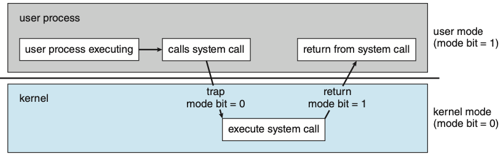
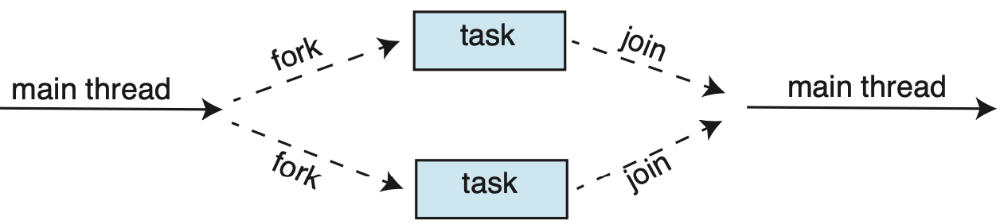

# Introduction

Operating system manages hardware and provides an environment for users to execute programs, acting as an intermediary between users and computer hardware

A computer system can be divided into

- Hardware that provides computing resources
- Application programs that define how these resources are used
- Operating system that controls hardware and coordinates its use across applications for users
- Users

{ height=200px}

The main goal of a computer system is to make it easier to solve user problems; computer hardware is hard to use so we create application programs to make it easier to solve user problems. 

These programs require some common operations that all require functions to control resources. The operating system was designed to manage these resource controlling functions.

Software components of a computer system:

- **Kernel**: operating system program running at all times
- **System Programs**: programs associated with the operating system but are not part of the kernel
- **Application Programs**: programs not associated with the operating system
- **Middleware**: software frameworks that provide services to application developers

There are 2 main view points of an operating system:

- **User View**: operating system focuses on ease of use rather than resource utilization
- **System View**: operating system is a resource allocator and manager resource requests from programs. It is also a control program, managing execution of user programs to prevent errors

## Computer System Organization

Computer system is made up $\geq 1$ CPU and several device controllers connected via a bus that provides access between components and shared memory

{ height=200px}

The **Device Controller** manages a specific type of device. 

- Maintains a local buffer storage and registers
- Its role is to move data between devices and local storage
- **Note**: CPU and device controller can execute in parallel; the **memory controller** synchronizes access to memory

The **Device Driver** provides the rest of the operating system an interface to a particular device controller and device type

An example of how a computer system operation works (I/O read)

1. Device driver loads registers in device controller
2. Device controller examines the contents of the register and determines the next action
3. Device controller transfers data from the device to local buffer
4. Once done, the device controller inform the device driver (**interrupt**)
5. Device driver gives control to another part of the operating system (e.g. return data read)

Hardware or device controller **raises** an interrupt by sending a signal to the CPU via bus

When the CPU **catches** the interrupt, it will stop what it's doing and immediately **dispatches** the appropriate interrupt handler

- Interrupt service handler start addresses are maintained in an **interrupt vector** for fast lookup. These vectors might also use **interrupt chaining** to save space
- The interrupt will also save state info of whatever was interrupted so it can be restored after the interrupt has been serviced

The handler **clears** the interrupt by the servicing the device

Once the service has been finished, the CPU resumes the interrupted computation

\pagebreak

{ height=300px}

The CPU maintains an **interrupt-request line** that it checks after each instruction

- **Maskable line**: CPU can turn off before a critical sequence of instructions
- **Nonmaskable line**: CPU cannot turn off

CPU also maintains **interrupt priority levels** that allows CPU to defer handling lower priority interrupts without completely masking them

&nbsp;

Bootstrap programs are used to load operating system when the computer boots up

CPU can only load instructions from memory (RAM)

- Memory is provided as an array of bytes of addresses
- `load`: moves byte from main memory to CPU register
- `store`: moves byte from register to main memory

Typical instruction-execution cycle:

1. Fetch instruction from memory and store in **instruction register**
2. Decode instruction
3. Fetch operands from memory and store in **internal register**
4. Execute instructions and save results in memory

Programs are usually stored in secondary storage (non-volatile)

\newpage

{ height=300px}

## Computer System Architecture

**CPU**: hardware that executes instructions

**Processor**: chip with $\geq 1$ CPU

**Core**: basic computation unit of CPU

**Multicore**: $> 1$ core on the same CPU

**Multiprocessor**: has $> 1$ processor

Types of computer systems can be organized by the number of processors they use

### Single Processor Systems

Consists of a single process with a single core that executes instructions and registers for storing data locally

- Devices may have special-purpose processors but these have a limited instruction set

### Multiprocessor Systems

$> 1$ processor, each with a single core CPU

- Processors share bus, memory, and devices
- Increases throughput, though not linearly because of processor management overhead

{ height=200px}

## Operating System Operations

**Process**: program in execution

 When a computer first boots up, bootstrap programs load the operating system kernel

 - Once the kernel is executing, the kernel provides services

 **System daemons**: services provided outside of the kernel but are running while the kernel is running

 If no processes are executing and no events are occurring, the operating system will sit idle, waiting for an interrupt:

- **Hardware interrupt**
- **Trap**: software generated interrupt from error
- **System call**: user program requests operating system service

**Multiprogramming**: ensures that the CPU has a process running by having the operating system load up several processes in memory and picking one to execute until it blocks. Once a process blocks, the next process will execute

**Multitasking**: CPU executes multiple processes by switching between them frequently, giving the user a fast **response time**

Since several processes are in memory at the same time we need

- **CPU scheduling**
- **Concurrent process management**

**Virtual Memory**: allows users to run larger programs than actual physical memory

Operating system has multiple modes of operations to ensure user programs can't cause other programs to crash. The mode is indicated by a **mode bit** in the hardware

- **Kernel mode**: runs privileged instructions
- **User mode**

{ height=150px}

**System calls**: allow users to request operating system to perform a task for them. This call is treated as an interrupt

Operating system also manages a **timer** to ensure that user programs don't run indefinitely

- After the timer expires, an interrupt is raised

## Resource Management

**Process Management**:

- Single-threaded processes have a program counter indicating the next instruction to execute
- Multithreaded processes have several program counters to the next instruction
- A system consists of several processes executing concurrently by multiplexing the single CPU core, so we need a way to

  - create/delete processes
  - Schedule and synchronize processes

**Memory Management**:

- Keep track of which parts of memory are being used
- Allocate/deallocate memory space
- Device which processes and data to move in and out of memory

**File System Management**:

- Create and delete files/directories
- Manipulate files/directories

**Mass Media Storage Management**:

- Manage secondary storage

**Cache Management**:

- Cache replacement policy
- Ensuring cache coherency in a multitasking environment

**I/O Management**:

- Buffering, caching, spooling 
- Device driver interface

## Protection and security:

**Protection**: controls process or user access to resources
**Security**: defends against malicious attacks

## Virtualization

Abstracts hardware of computer into different execution environments that can each be viewed as individual operating systems

## Distributed system

Collection of physically separate computer systems that are connected to provide various resources

# Operating System Structures

Operating System can be viewed from 3 perspectives: services it provides, user interfaces it creates, and interconnection between its components

## Operating System Services

The operating system provides an environment for programs to execute in, providing several services for programs to use. Some of these services include

- User interface: allows users to interact with program
- Program execution: loading a program into memory and running it
- I/O operations: allows programs to perform I/O operations while still preventing users from controlling I/O devices directly
- File-system manipulation: allows programs to create, delete, and modify files, and manage file permissions
- Communications: allows processes to exchange information with another process
- Error detection: handles errors from CPU or hardware
- Resource allocation: allocates resources to multiple concurrent processes
- Logging: creates records to keep track of how much resources each program uses
- Protection and Security: protection of user information from concurrent processes

## Operating System Interface

One example of an interface is the command-line interface that allows users to directly enter commands for the operating system to perform. These interfaces are called **shells**. Commands are either

- contained in the command interpreter and can be executed immediately
- implemented as system programs so the interpreter needs to load the appropriate program into memory and execute it

## System Calls

**System calls** provide an interface to the services provided by the operating system. System calls are abstracted from the user who make calls to functions defined by provided the API. These API functions end up calling the system calls for the user.

**Run-time environment (RTE)** provides an interface that links user API calls to system calls made available by the operating system

There are 3 general methods for passing parameters into the operating system

- directly passing parameters in registers
- storing parameters into a block and pass the address of the black as a parameter
- push/pop parameters onto a stack

{ height=300px }

System calls can be grouped into 6 major categories

  - Process control: create, terminate processes and lock data
  - File management: create, delete files
  - Device management: grant or wait for resource availability
  - Information maintenance: exchange data between user programs and operating system
  - Communication: exchange messages between processes
    - Shared model: share same memory registers
    - Message-passing model: processes exchange messages between each other (e.g. packets)
  - Protection: control access to resources

## System Services

**System services** provide a environment for programming development and execution

## Linkers and Loaders

Source files get converted into object files to be loaded into memory (**relocatable object file**)

**Linker** combines object files into executable
  
**Loader** loads binary file into memory for execution, where it can run on a CPU core

{ height=300px }

## Apps on Different Operating Systems

How apps are made to run on multiple operating systems:

  - Written in an interpreted language available on multiple operating systems
  - Written in a language with a virtual machine containing the running app
  - App developer uses API and compiler generates operating system specific binaries (app must be ported to each operating system)

## Operating System Design and Implementation

From the user perspective, we want the system to be easy to use, reliable, and fast

From the developer perspective, the system should be easy to develop and maintain

**Mechanism**: determine *how* to do something (rarely change but should be flexible enough to work across a range of policies)

**Policy**: determine *what* will be done (change based on underlying mechanism)

## Operating System Structure
  
**Monolithic**: place all kernel functionality in a single binary file (fast but difficult to manage)

**Layered approach**: moduralize operating system with limited functionality that comprise the kernel

**Microkernels**: removes nonessential components from kernel and moves them to user-level programs

**Modules**: kernel is a set of core components that can link in additional services via modules (linking is preferable to adding new features since it's faster and easier to manage)

# Processes

## Process Overview

**Process**: program in execution that is allocated resources during execution

- System consists of collection of operating system and user processes

{ height=200px }

- **Text**: executable code
- **Data**: global variables
- **Heap**: dynamically allocated memory
- **Stack**: temporary data storage (function parameters, local variables)

  - Each time a function is called an **activision record** (function parameters, local variables, return address) is pushed onto the stack

&nbsp;

A program is known as a **passive entity** whereas a process is known as an **active entity**. Processes have different **states**:

- **New**: being created
- **Running**: instructions being executed on allocated core
- **Waiting**: waiting for an event
- **Ready**: waiting to be assigned a processor
- **Terminated**: finished execution

{ height=200px }

**Process Control Block**: contains information about process

- **Process State**
- **Program Counter**: address of the next instruction
- **CPU Register**: contains process state information when context switching occurs
- **CPU-Scheduling Information**: pointers to scheduling queues and any scheduling parameteres
- **Memory-Management Information**
- **Accounting Information**
- **I/O Status**: list of I/O devices allocated for the process

Note that PCB can be expanded to include information of each thread for a multi-threading environment

## Process Scheduling

**Process Scheduler** selects an available process for execution on its core

**Degree of Multiprogramming**: number of processes in memory

A process can either be

- **I/O Bound**: spends more time doing I/O operations than CPU computations (this is usually the case)
- **CPU Bound**: generates I/O requests infrequently so it spends more time doing CPU computations

When a process enters the system, they are put into a **Ready Queue** (Linked List) of PCBs. The queue header has pointers to the first PCB and last PCB

When a process is blocked or waiting, it is put into a **Wait Queue** (Linked List) of PCBs. The queu header has pointers to the first PCB and last PCB. Once one of these processes is ready, it is removed from the wait queue and is placed back in the ready queue.

When a process is **dispatched** for execution, one of the following scenarios can occur:

- Process is blocked and is placed in the wait queue
- Process spawns a child and is waiting for the child to terminate
- Process is removed from the core because of an interrupt or time slice has expired. The process is then put in the ready queue

{ height=200px }

**CPU Scheduler** selects a process in the ready queue and allocates the core to it

**Swapping**: idea is to remove process from memory to reduce degree of multiprogramming. The process can be reintroduced at a later point and execution continues where it left off

**Context Switching**: when switching between processes (e.g. an interrupt occurs), the system must save the current context of the process in the PCB. When the process is restored, its context is also restored

{ height=300px }

## Process Operations

Processes are identified with a unique **pid**

When a child process is created, it needs certain resources to accomplish its task. These resources can be

- Directly allocated by operating system
- Taken as a subset of the parent's resources

The parent process can either

- Execute concurrently with its child
- Wait until some or all of its children have terminated

For address-space, the child process can

- Share the same address and parent of its parent
- Load a completely new program

```C
int main() {
  pid_t pid;
  pid = fork();

  // Error occured
  if (pid < 0) {
    ...
  // Child process
  } else if (pid == 0) {
    execlp("/bin/ls", "ls", NULL);
  // Parent process
  } else {
    wait(NULL);
    printf("Child Complete");
  }
}
```
{ height=300px }

After a process finishes execution, it asks the operating system to delete it by calling `exit()`. Afterwards, all resources the process had are deallocated and reclaimed by the operating system

- Process entry is still in the process table until parent calls `wait()`. This table holds a process's exit status
- **Zombie process**: process has terminate but parent hasn't called `wait()`
- **Orphan process**: processes with no parents

Processes can also terminate other processes (typically parent terminates child)

- Child has exceeded resource use
- Task assigned to child isn't required anymore
- Parent exits and child terminates alongside it (**cascading termination**)

## Interprocess Communication

**Independent process**: doesn't share data with other processes executing

**Cooperating process**: can affect or can be affected by other processes executing

- **Information sharing**: allows applications to concurrently access the same information
- **Computation speedup**: tasks can be divided into subtasks that can be run in parallel
- **Modularity**: divide system functions into separate processes

Cooperating processes require an **Interprocess Communication (IPC)** mechanism

- **Shared memory**: region of memory is shared between cooperating processes
- **Message passing**: messages are exchanged between cooperating processes

{ height=200px }


## Shared Memory Systems

Shared memory region usually resides in the address space of the process creating the shared-memory segment

- If another process wants to communicate using shared-memory segment, it must attach it to its address space
- 2 processes must agree to remove operating system restriction on accessing another process's memory
- Data exchanged by reading and writing to the shared area

Example use would be a **producer-consumer** scenario. 2 types of buffers can be used

- **Unbounded buffer**: no limit on size of buffer so consumer may need to wait for new items but producer can always produce new items 
- **Bounded Buffer**: finite size buffer so consumer has to wait if buffer is empty and producer has to wait if buffer is full
- Consumer has an `in` position variable and producer has `out` position variable for concurrent access

```C
item next_produced;
while (true) {
  // producer is blocked 
  while (((in + 1) % BUFFER_SIZE) == out);

  buffer[in] = next_produced;
  in = (in + 1) % BUFFER_SIZE;
}
```
```C
item next_consumed;

while (true) {
  // consumer is blocked
  while (in == out);

  next_consumed = buffer[out];
  out = (out + 1) % BUFFER_SIZE;
}
```

## Message Passing Systems

Process `send` and `receive` messages (fixed or variable size) to and from each other. Messages are sent across a **communication link**

### Direct/Indirect Communication

**Direct Communication**: each process explicitly names who it wants to communicate with

**Indirect Communication**: messages are sent to mailboxes or ports, allowing processes to communicate with another process via multiple mailboxes

### Synchronization

Message passing can either be **blocking/synchronous** or **nonblocking/asynchronous**

### Buffering

**Zero Capacity**: queue cannot hold any message so the sender blocks until the recipient receives the message

**Bounded Capacity**: queue has finite length. If the queue is not full, the message is placed in the queue and the sender doesn't block. If the queue is full, then the sender must block

**Unbounded Capacity**: queue length is infinite so the sender never blocks

# Threads

## Overview

**Threads** are a basic unit of CPU utilization

- Thread ID
- Program counter
- Register set
- Stack

It shares data with other threads belonging to the same process

- Code section
- Data section
- Operating-system resources (open files and signals)

A process can either be **single-threaded** or **multithreaded**

{ height=200px }

Benefits of Multithreading:

- **Responsiveness**: interactive applications can continue running even if part of it is blocked, thus increasing responsiveness to the user
- **Resource Sharing**: Normally processes can only share data through IPC. Threads share memory and resources from the parent process.
- **Economy**: Easier to create and context-switch threads rather than processes since threads share the resources of the parent process
- **Scalability**: Threads can run in parallel on different cores

## Multicore Programming

**Multicore**: systems where multiple cores are placed in a single processor and each core is treated as a separate CPU.

Meaning of concurrency in single core vs multicore

- In single core, concurrency means that execution of threads is interleaved
- In multicore, concurrency means that some threads will run in parallel

**Challenges with Multicore Systems**

Goal is to make use of parallel execution

- **Identifying Tasks**: find tasks that can be divided into separate, concurrent tasks
- **Balance**: ensure that each task performs equal work of equal value
- **Data Splitting**: ensure that data is divided to run on separate cores
- **Data Dependency**: ensure that data access is synchronized between threads
- **Testing and Debugging**: need to test different execution paths with concurrent programming

Types of Parallelism

- **Data Parallelism**: distributes subsets of the same data across multiple cores to perform same operation on each
- **Task Parallelism**: distributes tasks across multiple cores. Each thread performs a unique operation

{ height=200px }

## Multithreading Models

Types of threads include **user threads** and **kernel threads**. The types of relationships between these threads include

- **Many-to-One Model**: many user level threads mapped to one kernel thread. If a user thread makes a blocking call, the entire process will block. Also multiple threads are unable to run in parallel on a multicore system

{ height=100px }

- **One-to-One Model**: each user thread maps to a kernel thread, providing more concurrency than many-to-one model by allowing threads to run when another one makes a blocking system call. Also allows multiple threads to run in parallel on multiprocessors. Drawback is that it could require a lot of resources since each user thread is allocated a kernel thread

{ height=100px }

- **Many-to-Many Model**: several user threads multiplexed so several kernel threads. Doesn't require as much resources as one-to-one model but still allows kernel to schedule another thread for execution if another thread performs a blocking system call. Issue is that it is difficult to implement

{ height=100px }

## Thread Libraries

Thread Libraries are implemented usually 2 different ways:

- Provide the library entirely in the user space with no kernel space, so all code and data structures exist in user space. This results in local function calls in user space, not system calls
- Implement kernel-level library supported by the operating system. Here code and data structures exist in kernel space so function invocation involves a system call to the kernel

There are 2 types of threading strategies:

- **Asynchronous Threading**: parent and child thread can run concurrently and independently of each other. This typically results in little data sharing
- **Synchronous Threading**: parent thread waits for all of its children to terminate before it resumes. Usually involves data sharing among threads.

**Pthreads**: POSIX API for thread creation and synchronization. Below is a threading example used to calculate the summation of non-negative integers

```C
int main(int argc, char *argv[]) {
  pthread_t tid;          // thread id
  pthread_attr_t attr;    // thread attributes

  pthread_attr_init(&attr)  // set default attr of thread
  pthread_create(&tid, &attr, runner, argv[1]);
  pthread_join(tid, NULL)   // wait for thread to exit

  printf("sum = %d\n", sum);
}

void *runner(void *param) {
  int i, upper = atoi(param);
  sum = 0;
  for (i = 0; i <= upper; i++) {
    sum += i;
  }
  pthread_exit(0);
}
```

## Implicit Threading

**Tasks** are mapped to a separate thread for execution, usually in a many-to-many model

### Thread Pools

One issue of multithreading is that we need to put an upper bound on how many threads we can service. Using a **thread pool**, where we have a number of threads in a pool waiting for work, solves this issue.

- When a request is received, it submits a request to the thread pool, rather than creating a new thread. If the pool has no thread available, the task is queued until one becomes free.
- Once a thread completes its service, it returns to the pool and awaits more work

### Fork Join

Parent thread creates **forks** and waits for the children to terminate and **joins** with the parent

{ height=100px }

## Threading Issues

### Fork() and Exec()
If a thread calls `fork()`, does the new process duplicate all threads or is the new process single-threaded?

If a thread calls `exec()`, the entire process will be replaced, including all of its threads

### Signal Handling
**Signal**: notifies a process that a particular event has occurred and can be received **synchronously** or **asynchronously**. All signals follow the same pattern

- Signal generated by a particular event
- Signal is delivered to a process
- Signal is handled

Example of synchronous signals include illegal memory access and division by $0$

Example of asynchronous signals include terminating a process using `<Cr>c`. These signals are usually generated outside the process and sent to another process

Signals are handled using either

- **Default Signal Handler**: run by the kernel
- **User-defined Signal Handler**: defined by the user and overrides default signal handler

For single-threaded programs, signals are always delivered to a process. However, for multithreaded programs, several options exist for delivering a signal.

- Deliver signal to the specific thread that the signal applies to
- Deliver signal to every thread in process
- Deliver signal to certain threads in process
- Assign a specific thread to receive all signals for the process

To deliver a signal in UNIX, specify the `pid` and `signal`

```C
kill(pid_t pid, int signal);
```

### Thread Cancellation

**Thread Cancellation** terminates a thread (**target thread**) before it has completed. There are 2 ways of cancelling a thread:

- **Asynchronous**: A thread immediately terminates the target thread

  - **Note**: cancellation when a thread is operating on data is tricky to handle. Thus canceling a thread asynchronously may not free a necessary system-wide resource

- **Deferred**: target thread periodically checks if it should terminate, allowing it an opportunity to terminate itself in a orderly fashion
  
  - Thread checks if it can be cancelled safely

```C
pthread_t tid;

pthread_create(&tid, 0, worker, NULL);
...
pthread_cancel(tid);      // cancel thread
pthread_join(tid, NULL);  // wait for thread termination 
```

**Note**: `pthread_cancel()` indicates only a request has been sent. The actual cancellation depends on how the target thread is set to handle the request. 3 types of cancellation modes are supported

- Off
- Deferred (default)
- Asynchronous

A **cleanup handler** can also be defined to handle thread cancellation

## Thread-Local Storage

Each thread can maintain a copy of certain data **thread-local storage** unique to each thread. Differs from local variables since TLS persists across function invocations

# Synchronization Tools

**Cooperating Process**: a process that can affect or be affected by other processes in execution. These process can

- Share the same logical address space
- Share data through shared memory or message passing

**Race Condition**: several processes access and manipulate the same data concurrently, resulting in different outcomes depending on the order of execution. To guard against these, we need to ensure only 1 process can manipulate the data, which involves synchronization

## Critical-Section Problem

**Critical Section**: code that is accessing data shared with at least 1 other process. Idea is that while 1 process is executing its critical section, no other process is allowed to execute its critical section

- **Entry Section**: section where process requests permission to enter critical section
- **Exit Section**: section after critical section
- **Remainder Section**: remaining code

Critcal-section problem must satisfy 3 requirements:

- **Mutual Exclusion**: If process $P_i$ is executing its critical section, no other process can execute its critical section
- **Progress**: If no process is executing its critical section and some processes wishes to enter its critical section, then only processes that are not executing in their remainder sections can participate in deciding which will enter its critical section next. Furthermore, selection cannot be postponed indefinitely
- **Bounded Waiting**: There is a bound on the number of times other processes can enter their critical section after a process has made a request to enter its critical section before that request is granted

In a single-core environment, the critical-section problem could be solved by preventing interrupts while a shared variable is being modified. In a multiprocessor environment, this is not feasible since disabling interrupts on all processors is time consuming. Instead, 2 approaches are used

- **Preemptive Kernels**: process can be preempted while it is running in kernel mode, creating a responsive environment
- **Nonpreemptive Kernels**: does not allow processes running in kernel mode to be preempted. Instead kernel-mode processes will run until it exits kernel mode or blocks. This is essentially free from race conditions since only there is only 1 active kernel process

## Peterson's Solution

Restricted to 2 processes $(P_0, P_1)$ that alternate execution between critical sections and remainder sections. Idea is that the 2 processes share 2 data items:

- `turn` indicates whose turn it is to enter critical section
- `flag` array indicates if a process is ready to enter its critical section

```C
int turn;
boolean flag[2];

while (true) {
  flag[i] = true;
  turn = j;
  while (flag[j] && turn == j);

  /* critical section */

  flag[i] = false;

  /* remainder section */
}
```

- **Mutual Exclusion**: $P_i$ enters its critical section only if `flag[i] == false` or `turn == i`. Also, if both processes are executing their critical sections at the same time, then `flag[i] == flag[j] == true`. However, both $P_0$ and $P_1$ couldn't have successfully executed the `while` statement since `turn` can either be $0$ or $1$, but not both
- **Progress** and **Bounded Waiting**: process $P_i$ can only be prevented from entering its critical section if it is stuck in the `while` loop where `flag[j] == true` and `turn == j`
  
  - If $P_j$ is not ready to enter its critical section, then `flag[j] == false` and $P_i$ can enter its critical section
  - If `turn == j` then $P_j$ will enter its critical section. Once $P_j$ exits, it will reset `flag[j] = false`, allowing $P_i$ to enter its critical section
  - If $P_j$ sets `flag[j] = true`, then it must also set `turn = i`, and $P_i$ will not change `turn`, thus it will enter its critical section after at most one entry by $P_j$

Peterson's Solution doesn't work on modern computers because the compiler may reorder operations that have no dependencies. For example:

```C
boolean flag = false;
int x = 0;

/* THREAD 1 */
while (!flag);
print x;

/* THREAD 2 */
x = 100;
flag = true;
```

Thread 2 may reorder its operations so that `flag = true` is set first. But then Thread 1 can interrupt Thread 2, resulting in `x = 0` being printed.

## Hardware Support for Synchronization

**Atomic Operation**: interruptible until of work. Can be abstracted to `test_and_set()` and `compare_and_swap()`

```C
boolean test_and_set(boolean *target) {
  boolean rv = *target;
  *target = true;
  return rv;
}

...
do {
  while (test_and_set(&lock));

  /* critical section */

  lock = false;

  /* remainder section */
} while (true);
```

Here `test_and_set()` is executed atomically. Then `lock` guarantees mutual exclusion

```C
int compare_and_swap(int *value, int expected, int new_value) {
  int temp = *value;

  if (*value == expected) {
    *value = new_value;
  }

  return temp;
}
...
while(true) {
  while (compare_and_swap(&lock, 0, 1) != 0);

  /* critical section */

  lock = 0;

  /* remainder section */
}
```

Here, `compare_and_swap()` sets `value` to `new_value` only if `*value == expected`, and always returns the original value of `value`. Mutual exclusion is provided since the first process that invokes `compare_and_swap()` will set `lock = 1` and enter its critical section. Subsequent calls to `compare_and_swap()` will not succeed since `lock != 0`, until the original process exits its critical section and sets `lock = 0`. However, the above algorithm fails bounded-waiting requirement

**Atomic Variables**: provide atomic operations on basic data types, ensuring mutual exclusion in data race situations on a single variable. For example
```
void increment(atomic_int *v) {
  int temp;
  do {
    temp = *v;
  }
  while (temp != compare_and_swap(v, temp, temp + 1));
}
```

## Mutex Locks

**Mutex Lock** is used to protect critical sections and prevent race conditions. Each process must `acquire()` the lock before entering its critical section, and `releases()` the lock when exiting its critical section

- If lock is unavailable, the process is blocked until the lock is released

Below is an example of **spin-lock**

```C
while (true) {
  /* acquire lock */

  /* critical section */

  /* release lock */

  /* remainder section */
}
```

This results in **busy waiting** - while a process is in its critical sections, all other processes that try to enter its critical section loops continuously in the `acquire()` call. This looping wastes CPU cycles that other processes could use productively. However, these loops do not require context switches, which takes a considerable amount of time.

## Semaphores

**Semaphore** $S$ is an integer variable accessed through atomic operations `wait()` and `signal()`

```C
wait(S) {
  while (S <= 0);   // busy wait
  S--;
}

signal(S) {
  S++;
}
```

There are 2 types of semaphores:

- **Counting Semaphore**: range over an unrestricted domain. Value is initialized to the number of resources available. If a process wants to use a resource, it calls `wait()`. When the process releases the resource, it calls `signal()`. When the semaphore is $0$, all resources are being used and the process is blocked until `count > 0`
- **Binary Semaphore** range over $0$ and $1$

Semaphores can also be used in synchronization problems. Suppose we have 2 processes and want statement $S_2$ to execute after statement $S_1$

```C
/* PROCESS 1 */
S1;
signal(synch);

/* PROCESS 2 */
wait(synch);
S2;
```

### Semaphore Implementation

Note that the definition of `wait()` and `signal()` above suffer from busy waiting. Instead, we can force `wait()` to suspend the process if `semaphore <= 0`, placing the process in the waiting queue. The process is restarted, by a `wakeup()` operation, when another process executes `signal()`. The process is then placed in the ready queue

Each semaphore has an integer value and a list of processes.

- When a process is waiting on a semaphore, it is added to the list of processes
- `signal()` removes a process from the list of waiting processes and awakens that process

```C
typedef struct {
  int value;
  struct process *list;   // can be represented as linked list of PCBs
} semaphore;

wait(semaphore *S) {
  S->value--;
  if (S->value < 0) {
    // add this process to S->list;
    sleep();    // suspends process that invokes sleep
  }
}

signal(semaphore *S) {
  S->value++;
  if (s->value <= 0) {
    // remove process P from S->list;
    wakeup(P);
  }
}
```

**Note**: with this implementation, semaphore value can be negative. This represents the number of processes waiting on that semaphore. In contrast, the busy waiting definition of semaphore prevents a negative value.

**Note**: must ensure that `wait()` and `signal()` are atomic; no 2 processes can execute `wait()` and `signal()` at the same time.

- For single processor environment, we can just disable interrupts during the critical section
- For multicore environment, we must disable interrupts on every processing core (this is costly)
