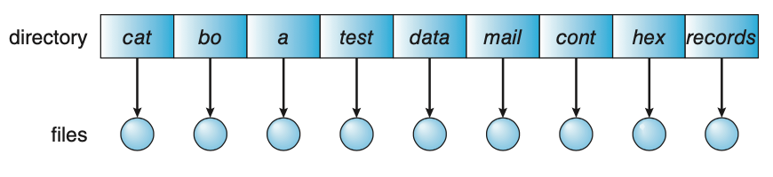
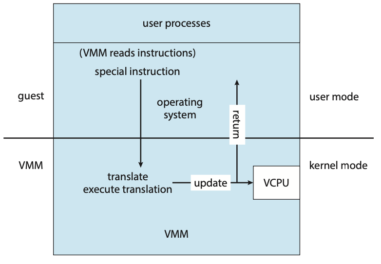

# File System Interface

**File**: Operating system defined logical storage unit that is mapped by operating system onto physical devices

  - **Text file**: sequence of characters organized into lines/pages
  - **Source file**: sequence of functions and executable code
  - **Executable file**: series of code sections loader can bring into memory and execute

## File Concepts

File contains many attributes that contain information stored in directories

- Name, identifier, type, location, size, protection, timestamp

File operations

- Create file: allocate space in file system and add new directory entry
- Open file: `open()` returns a file handle that is used in other operations
- Writing file: specify open file handle and specify info to write into file
  - **Write pointer** is maintained that points to location of file for next write
- Reading file: specify open file handle and specify where to put next block of data
  - **Read pointer** is maintained that points to location of file for next read
- Seek: move file pointer of open file
- Delete file: search directory for file name and release all free space for it
- Truncate file: maintain file attributes but release its file space

Operating system maintains **open-file tables** that contain information of open files to reduce search time. When multiple processes can open file simultaneously, operating system uses 2 tables

  - **Per process table**: tracks files opened by current process and some attributes (e.g. current file pointer)

    - Per process table entries point to system wide table
  - **System wide table**: contains process independent information (e.g. file size)

Information associated with an open file

- file pointer
- file-open count
- location of file
- access rights

Files might also have locks

- **shared lock**: several processes can acquire lock concurrently
- **exclusive lock**: only one process can acquire at a time

File type gives operating system hints as to how to handle the file and internal structure of the file

- Operating system needs to maintain code to support all of these file structures
- Operating system has to support at least one file structure: the executable file
- Usually each program includes its own code to interpret a file

## Access Methods

**Sequential access**: read/write advance a file pointer

- Can also rewind/move pointer forward

{ height=150px}

**Direct access**: file is made up of several fixed-length logical records that allow the program to read and write records rapidly

  - Each file contains a numbered sequence of records
  - File operations must include the block number as a parameter
  - block numbers are usually indices relative to the beginning of the file

**Other access methods**: 
  
  - Use an **index**: pointer to various blocks
  - To find a record, need to use index to get pointer to record

{ height=200px}

## Directory Structure

Symbol table that translates file name to file control blocks

Important operations that must be supported

- Search file
- Create file
- Delete file (might leave a hole in directory structure)
- List files in directory
- Rename file (might restructure directory)
- Traverse file system

**Single Level Directory**: all files contained in the same directory

- Main issue of file names must be unique and managing large number of files is cumbersome. Thus not really scalable

{ height=100px}

**Two Level Directory**: each user has its own **user file directory (UFD)**

- Entry point to each UFD is provided by the **master file directory (MFD)**
- To operate on a file, operating system searches for the user's UFD
- Solves name-collision problem of single level directory
- Structure isolates users so cooperation between processes is difficult (e.g. when processes are accessing each other's files)

  - Need to specify the file path (username + filename)

{ height=100px}

**Tree Structured Directories**: allows users to create their own subdirectories

- Root directory is the top level
- All files have a unique path name
- directories are sets of files or subdirectories and is considered its own file type
- directories and files are usually distinguished using a bit (e.g. 0 for directory and 1 for file)
- Each process has its own current directory
- file reference must use either **relative path** or **absolute path**

  - Allows for easy user access to another user's files (use appropriate path)

- Tree deletion policies

  - Cannot delete directory unless it is empty (need to recurse through all subdirectories and delete files)
  - Just delete all directory file/subdirectories immediately

{ height=200px}

**Acyclic Graph Directories**: allow directories to share file/subdirectories

  - File created by 1 user auto appears in the shared subdirectory
  - Implemented by creating **links**: directory entries that point to another file/subdirectory (usually as some sort of path)
    
    - Operating system usually ignores links when traversing to prevent cyclic traversal (looping into the same subdirectory)
  - Can also be implemented by duplicating all information of shared files

    - Difficult to maintain consistency between shared files when a file is modified

  - Problems:

    - Files might have several absolute paths so distinct paths refer to the same file
    - When deallocating a shared file, it might create dangling pointers from the links

{ height=200px}

**General Graph Directory**: prevent cycles from links to improve performance by not searching through the same subdirectory twice

- **Garbage collection**: traverse entire file system and mark anything that can be accessed. Second pass through collects files that weren't marked onto free space. This removes any cycles in the graph

## Protection

To keep stored information safe from physical damage, we can duplicate copies of the files (usually onto tape)

**Types of Access**: goal is to provide controlled access to files by limiting the types of file access that can be made

- Read
- Write
- Execute
- Append
- Delete
- List
- Attribute change

**Access Control**: different users need different types of access to files

- **Access Control List**: specifies user name and what types of access are allowed for each user for each file or directory

  - When a user request access is made to the file, the operating system checks the ACL to see if the user has permission to the file

  - Main issues include not knowing all users in the system ahead of time and variable sized directory entries
  - Resolved by using 3 classifications and associating each group with a bit and permission type

    - owner of the file
    - group: set of users who are sharing the file and need similar access
    - other: all other users
- Can also associate a password with each file for protection (but this requires the user to memorize a password for each file)

## Memory Mapped Files

Part of virtual address space is logically associated with a file to increase performance

Maps disk blocks to a page in memory

  - Initial access to the file results in a page fault
  - Subsequent reads/writes are then from memory (onto the page)
  - Writes may not be synchronous (usually writes to secondary storage are delayed until the file is closed)
    - Can use swap space to ensure data is not lost in a memory intensive environment

Multiple processes can map the same file concurrently, allowing for data sharing

  -  Writes by any process modify the data in the virtual machine and can be seen by other processes (share the same page)

# File System Implementation

## File System Structure

Disks are main storage for file systems since

- Disks can be rewritten in place, so we can read a block, modify it, and write back in the same block
- Disk can directly access any info it holds (sequential or random access)

I/O transfer is done in units of blocks ($\geq 1$ sectors)

File system provides efficient access to storage devices. 2 design problems to consider

- How should the file system look to the user
- Algorithms and data structures to map logical file system onto physical devices

File system also consists of several levels that use features from the lower levels

- **I/O Control Level**: contains device drivers and interrupt handlers to transfer data between main memory and disk system layer
- **Basic File System Layer**: issues generic commands to the device drive to read/write blocks on storage device
- **File Organization Module Layer**: contains information about the files and their logical blocks
- **Logical File System Layer**: manages metadata information (everything but file content)

    - **File Control Block (FCB)** or **inode**: contains information about file (ownership, permissions, location)

## File System Operations

In secondary storage, File system holds information about how to boot the operating system and other useful information

- **Boot control block**: info needed by system to boot operating system
- **Volume control block**: volume details (number of blocks in volume, block size, FCB pointers)
- Directory structure: helps organize files
- Per File FCB that has file information

In memory, file system holds information for management and performance improvement

- **Mount table**: information about each mounted volume
- **Per process open file table**: tracks files opened by current process and some attributes (e.g. current file pointer)
- **System-wide open file table**: contains process independent information (e.g. file size)
- Directory structure cache
- Buffers to hold file system blocks

To create a file, the logical file system

- Allocates a new FCB
- Reads appropriate directory into memory, updates it with new file name and FCB, and writes back the directory to the file system

After the file is created, the file can be used for I/O

- First need to `open` the file. System search system wide file table and opens file if it is already open
- Add a new entry to the per process file table that has a pointer to the system wide file table entry
- `open` returns a pointer to the per process file table entry

  - All file operations are performed through this pointer
- on `close`, per process file table entry is removed and system wide file table entry open count is decremented

  - When all users close a file, any updated metadata is copied back to disk and the system wide file table entry is removed

{ height=300px}

## Directory Implementation

**Linear List**: linked list of file names with pointers to data blocks

  - Time consuming to use since we need to do a linear search to find the corresponding entry

    - Can sometimes cache directory information to speed up access time
  - When creating a file, we need to do a linear search to see if another file has the same name. If no file has the same name the new file is added to the end of the directory list

**Hash Table**: faster search time

  - Small issue of size and hash function used. When we need to expand the table size, a new hash function needs to be created and applied to all of the entries
  - Can instead used **chained overflow** hash table where each hash has a linked list of entries that mapped to the same hash value

## Allocation Methods

Goal is to allocate space for files in a way that is space efficient and allows for fast file access

**Contiguous Allocation**: each file occupies a contiguous block on the device

- Minimizes disk seeks since data is saved contiguously (near each other on disk)
- Fast access if we want to access index `i` of block `b` (just do `b + i`

  - Allows for both sequential and direct access

- Issues of dynamic storage allocation (external fragmentation)
- One solution is to copy the entire file system onto another device, then copy back files, compacting free space so that we only have one contiguous allocated space

  - Overhead cost can be high especially for devices with large disk spaces

- Another issue is figuring out how much space to allocate each file.

  - Under best fit model, this can be a problem if we allocate too little space
  - Can move data to another bigger hole when this happens but leas to overhead copying time
  - Can use **extent**: chunks of contiguous space that can be linked together by having blocks point to the next extent

{ height=200px}

**Linked Allocation**: each file is a linked list of storage blocks

- Directory maintains pointer to the first and last blocks of the file
- Blocks can be scattered anywhere on the disk and each block has a pointer to the next block
- To create a new file, computer system creates a new entry in the directory that points to the first block of the file

  - Traverse the list until we get a free space and can allocate it
  - This leads to no external fragmentation since size of the file can be dynamic
- Only useful for sequential access files since to find the ith block of a file, we need to traverse through file and follow pointers, each requiring a disk seek
- **Clusters**: group of blocks that can be allocated together to allocate more memory at a time

  - Can lead to increase in internal fragmentation

- Another issue of **reliability**: if a pointer gets damaged, it's very difficult to fix the issue. One solution is to use a double linked list but this requires more overhead management

{ height=200px}

- **File Allocation Table (FAT)**: beginning section of each storage contains a table that points to the first block of each file

  - Speeds up random disk access
  - Can result in large number of disk seeks

    - Read start of volume
    - Find location of block
    - Move to block

{ height=200px}

**Indexed Allocation**: places all block pointers to one location: the **index block**

- Each file has its own index block that has entries that point to file blocks
- When a block is written, the block is obtained from the free space and its address is put as an entry into the index block
- Supports direct access but can waste space due to pointer overhead (e.g. need the entire block even if there are only 2 valid pointers)
- A few mechanism to managing the index block exist

  - **Linked scheme**: for larger files, can link several index blocks together
  - **Multilevel index**: use first level index to point to a second level index block that points to file block
  - **Combined scheme**: keep first $15$ pointers of an index block in the file inode.

    - The first $12$ pointers will point to **direct blocks** that contain addresses of blocks with data
    - Last $3$ pointers are **single indirect block**, **double indirect block**, **triple indirect block** that point to several levels of index blocks (see picture)

{ height=300px}

## Free Space Management

System maintains a **free space list** that contains records of free device blocks that can be implemented in a variety of ways

**Bit vector**: each bit represents a block that is either free or not free

- Inefficient unless entire bit vector can be stored in memory

**Linked list**: links free bocks together

- Pointer to first free block is stored in cache
- Each free block has a pointer to the next free block

**Grouping**: store addresses of $n$ free blocks in the first free block

  - The first $n-1$ blocks are actually free. The last one is the address of another $n$ free blocks. Pattern continues

**Counting**: considering several contiguous blocks may be allocated or freed simultaneously, rather than keeping a list of free blocks, we can store the first free block and then the number of free contiguous blocks that follow it

## Efficiency and Performance

Disks are usually the main bottleneck in a system (slowest computer component)

### Efficiency

Efficiency of file system depends on allocation and directory algorithms used

  - For example, we can preallocate inodes and spread them across volumes to improve file system performance by reducing seek time

### Performance

System can maintain **buffer cache** in main memory where popular blocks can be kept

System can also use a **page cache**: virtual memory is used to cache file data as pages

- **Free-behind** policy: remove pages from the buffer as soon as the next page request comes. The idea is that once a page has been used, it's probably not going to be used again
- **Read ahead** policy: for a given page request, several subsequent pages are also read and cached, ultimately saving time. Idea is that the same locality of pages rely on each other

For memory mapped I/O need to maintain both buffer and page caches

- This causes **double caching** where read/writes into the buffer cache also need to be copied to the page cache, wasting memory and CPU cycles

- Instead use a **unified buffer cache**

{ height=200px}

{ height=200px}

**Synchronous Write**: occurs in the order that storage subsystem receives them. Writes CANNOT be buffered (e.g. file metadata)

**Asynchronous Write**: data is stored in cache and is written to disk when it is convenient

## Recovery

Computer system needs to ensure that a system crash doesn't cause inconsistencies between on storage file system data structures

- For example, cached changes make it to storage

**Consistency check**: file system checks for file corruption

- Scanning all file metadata takes too long
- Can instead use a status bit that indicates if a file is in flux. The bit is cleared once all metadata has finished updating
- **Consistency checker**: program that compares data in directory structures and file metadata with state on storage, and tries to fix any inconsistencies

**Log Structured File System**: all metadata and transactions are written to logs

- Idea is that if a corruption is irreparable, we need human interference, and the logs will provide useful information
- Once changes are written to log, they are considered **committed**
- Log entries are replayed on the actual file system structures
- Aborted/uncommitted changes must be reverted to preserve consistency of file system

**Snapshot**: provides a view of the file system at a specific time

- Transactions write data/metadata to a new block, creating new snapshots
- Snapshots are used as a fallback if the system crashes

**Backup/Restore**: back up data to a storage device. On crash, restore data from back up

# Network and Distributed Systems

**Distributed System**: collection of processors that each have their own local memory and don't share memory

- Nodes are connected via a network
- Messages are passed between systems across the network

## Benefits of Distributed Systems

- **Resource Sharing**: can share files between remote sites
- **Computation Speedup**: Can run subcomputations concurrently

  - Might require **load balancing** by routing requests to another node

- **Reliability**: if one site fails, the remaining sites can still operate

## Network Structure

**Local Area Network (LAN)**: hosts are distributed over a small area

**Wide Area Network (WAN)**: system is distributed over a large area

## Communication Structure

Processes on remote systems are identified using `<hostname, identifier>`

To resolve a host name into a host-id for the computer to read, 2 options can be used

- Every host holds a data file with all mappings of reachable hosts on the network. Main issue with is that it isn't scalable for nodes leaving and entering the network
- Distribute information among systems on the network (e.g. DNS)

**Note**: operating system is responsible for accepting outgoing messages to `<hostname, identifier`. The Kernel of the destination host is responsible for transferring messages to the appropriate process

Communication between systems is handled in layers (e.g. OSI Layer)

- Each layer communicates with the equivalent layer on the other system
- Each layer has its own protocols

## Network and Distributed Systems

**Network Operating System**: provides an environment for users to access remote resources. There are 3 ways of doing this

- **Remote Login** (e.g. ssh) to access remote machine

  - Creates a bidirectional link to the resource.

- **Remote File Transfer**: each computer maintains its own local file system. To share a file, it must be copied explicitly from the source to the destination system

  - Creates a unidirectional link to the resource

- **Cloud Storage**: upload and download files from a cloud service

**Distributed Operating System**: users access remote resources they access local resources

- **Data Migration**: transfer a file from site B to site A. Then the file can be accessed locally on site A. Any changes are written back to site B. 2 ways of doing this

  - Transfer the entire file
  - Transfer only parts of the file site A needs. This may require multiple requests

- **Computation Migration**: goal is to do computation locally and send a message with the result of the computation

- Process P executes a remote procedure call on site A and retrieves the result
- Process P sends a message to site A and the operating system on site A creates a new process Q to carry out the task and sends the result to process P via messaging system

**Process Migration**: parts of a process might be executed at different site. Variety of benefits

- load balancing, computational speedup, hardware preference, software preference, data access

2 main approaches

- System hides process migration from the client
- Allow users to specify explicitly how processes should be migrated

## Distributed System Design Issues

**Robustness**: need to be able to detect failures and be **fault tolerant** (can continue to function even when failures occur)

- Failure detection done using **heartbeat procedure** where a alive messages are sent between sites periodically

**Transparency**: distributed system should look like a normal centralized system to the user
  
  - Local and remote resources are accessed similarly

**Scalability**: system can adapt to an increase in service load

## Distributed File System (DFS)

**Server**: software entity that provides clients a service

**Client**: process that invokes services of the server

File system provides file services to clients

Distributed file system provides file services to distributed clients

  - Servers provide services across the network
  - Appears as a centralized file system to clients

2 main models:

- **Client Service DFS Model**: servers store files and clients connect to the server to make request for files
- **Cluster Based Model**: clients connect via the network to a **master metadata server** and several data servers that hold chunks of files

  - The metadata server stores mappings of chunks of files to data servers
  - Each file chunk is replicated across multiple file servers for reliability
  - To access a file, the client contacts the metadata server and goes to the closet data server to request for a file chunk
  - Reduces performance bottleneck since file chunks are replicated

## DFS Naming and Transparency

**Naming**: maps between local and physical objects

Transparent DFS adds another layer of abstractions: where the file is located

2 types of naming structures

- **Location transparency**: name of file doesn't reveal the file location
- **Location Independence**: name of the file doesn't need to be changed when storage location changes

**Naming Schemes**

- hostname + local name
- **Network File System (NFS)**: attach remote directories to local directories, creating a directory tree

## Remote File Access

**Remote Service Mechanism**: requests are delivered to the server and results are forwarded to the user (RPC paradigm)

**Caching** is used to improve performance

- Copy of the data is given to the client
- When cached data is changed, need to update the master copy on the server (**cache consistency**)
- Cache can be stored on disk (more reliable) or in main memory (faster access)

# Virtual Machine

**Virtual Machine**: abstracts hardware on a computer into several different execution environments, each one treated as though it is running on a private computer

- **Host**: underlying hardware system that runs the VM
- **Virtual Machine Manager (VMM)**: creates VMs by providing an interface identical to the host
- **Guest**: process that is provided a virtual copy of the host

Advantages of VM

1. Host system is protected from VMs so VMs in guest operating systems don't affect other guests or host. Similar idea for protection, don't need to worry about it since systems are isolated

  - Small issue of not being able to share resources. Can get around this by using message passing
2. VMM provides **snapshots** of a host to the guest who then creates a **clone** and **resumes** or **suspends** the VM
3. **Consolidation**: allows multiple operating systems to run on the same workstation

{ height=200px}

## Building Blocks

**Virtual CPU (VCPU)**: represents the state of the CPU as the guest machine believes it to be (similar to PCB)

- VMM maintains VCPU. When the guest context switches onto the CPU, information on the VCPU is used to load the current context

**Trap and Emulation**: guest may be in **virtual user mode** or **virtual kernel mode**. Both of these run in physical user mode. 

- For the guest to execute priveleged code, virtual user mode causes a trap to VMM in the real machine. Then the real kernel emulates the action for the virtual kernel and then returns control to the VM

## Binary Translation

- If the guest VCPU is in user mode, guest can run its instructions natively on physical CPU
- If guest VCPU is in kernel mode, the guest believes it is in kernel mode so VMM examines guest isntructions

    - special instructions are translated to equivalent task to run locally
    - otherwise normal commands are run natively

{ height=200px}
